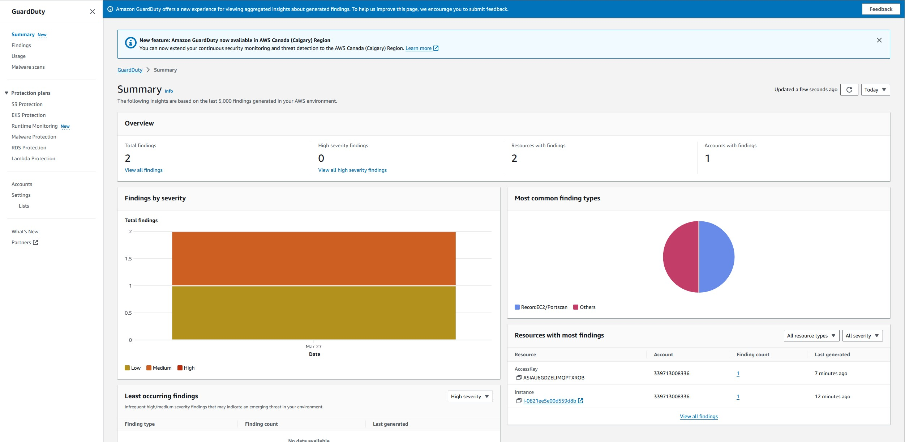
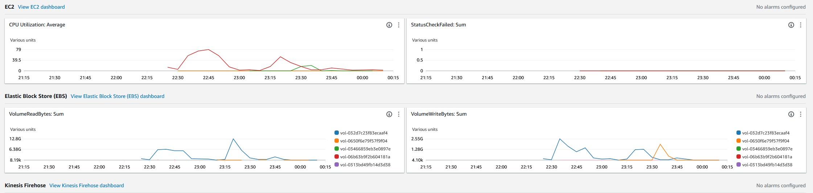

# Multi-Subnet Cybersecurity Training Lab Setup on AWS
> Authors: Emmanuel Apiteu, Zedd Chisholm (Team Lead), Abraham DeLaCruz, KJ McDaniels, Opeyemi Olaleye, Alawi Raashed, Yonisbel Soto (Project Manager)

## Table of Contents

- [Introduction](#introduction)
- [Initial Setup and Configuration](#initial-setup-and-configuration)
  - [AWS Account Preparation](#aws-account-preparation)
  - [Environment Setup](#environment-setup)
- [VPC and Networking Configuration](#vpc-and-networking-configuration)
  - [VPC Creation](#vpc-creation)
    - [1. Design the CIDR blocks for your VPC and subnets](#1-design-the-cidr-blocks-for-your-vpc-and-subnets)
    - [2. Navigate to the VPC dashboard and create a new VPC](#2-navigate-to-the-vpc-dashboard-and-create-a-new-vpc)
  - [Subnet Creation](#subnet-creation)
  - [Internet Gateway and Route Tables](#internet-gateway-and-route-tables)
- [Security Configurations](#security-configurations)
  - [Security Groups and ACLs](#security-groups-and-acls)
  - [IAM Policies for Resource Access](#iam-policies-for-resource-access)
- [Instance Management](#instance-management)
  - [EC2 Instance Launch](#ec2-instance-launch)
  - [Instance Networking and Security](#instance-networking-and-security)
- [AWS Security Services Integration](#aws-security-services-integration)
  - [Amazon GuardDuty](#amazon-guardduty)
  - [Amazon Inspector](#amazon-inspector)
  - [AWS WAF](#aws-waf)
  - [Amazon CloudWatch](#amazon-cloudwatch)
- [Testing and Validation](#testing-and-validation)
- [Troubleshooting and Optimization](#troubleshooting-and-optimization)
- [Documentation and Collaboration](#documentation-and-collaboration)
- [Conclusion and Next Steps](#conclusion-and-next-steps)
- [Appendices](#appendices)
  - [A: AWS CLI and SDK Examples](#a-aws-cli-and-sdk-examples)
  - [B: Useful AWS Documentation and Resources](#b-useful-aws-documentation-and-resources)
  - [C: Glossary of Terms](#c-glossary-of-terms)
- [References](#references)

## Introduction

This document serves as a guide for setting up a multi-subnet cybersecurity training lab within AWS. The lab is designed to provide hands-on experience with securing cloud infrastructure using AWS's native security services. This README outlines the steps to configure a VPC with multiple subnets, security groups, and AWS security services for a comprehensive cybersecurity training environment.

## Initial Setup and Configuration

### AWS Account Preparation

- **Account Creation:** Ensure that you have an AWS account created and you're able to access the AWS Management Console.
    - You can find detailed instructions to do so in the [AWS Account Creation Guide](/assets/docs/AWS-Account-Creation.md)
- **IAM Roles and Policies:** Set up IAM roles with appropriate policies to provide your team with necessary access levels.

### Environment Setup

- Get familiar with the AWS Management Console.
- Check and adjust service limits in your region to suit the lab requirements.

## VPC and Networking Configuration

### VPC Creation

#### 1. Design the CIDR blocks for your VPC and subnets

- **Determine CIDR for VPC**: Choose a CIDR block for the VPC. A common practice is to use a `/16` CIDR block (e.g., `10.0.0.0/16`) to provide ample IP addresses for lab scenarios.
- **Plan Subnets**: Divide the VPC CIDR block into smaller CIDR blocks for each subnet. Planning might include a public subnet for internet-facing resources and private subnets for backend systems. For example:
  - Public Subnet: `10.0.1.0/24`
  - Training Tools Subnet: `10.0.2.0/24`
  - Active Directory Subnet (Optional): `10.0.3.0/24`
  - Docker Containers Subnet (Optional): `10.0.4.0/24`

#### 2. Navigate to the VPC dashboard and create a new VPC

- **Access the VPC Dashboard**: Log into the AWS Management Console, navigate to the "Services" menu, and select "VPC" under the "Networking & Content Delivery" category.
- **Launch VPC Wizard**: Click on "Launch VPC Wizard" to start the VPC creation process.
- **VPC Configuration**:
  - Choose "VPC with a Single Public Subnet" for simplicity or "VPC with Public and Private Subnets" for more complex setups.
  - Enter the VPC CIDR block and subnet CIDR as designed in the previous step.
  - Name your VPC and subnets for easy identification (e.g., "CyberSecLab-VPC" and "CyberSecLab-PublicSubnet").
  - Configure other options as necessary, such as enabling DNS hostname and DNS resolution.
- **Create VPC**: Review your configurations and click "Create VPC" to establish your new VPC.

### Subnet Creation

1. Plan and create four subnets: Public, Training Tools, Active Directory (optional), and Docker Containers (optional).
2. Assign appropriate CIDR blocks to each subnet.

### Internet Gateway and Route Tables

1. Create and attach an Internet Gateway to your VPC.
2. Set up route tables for your subnets, ensuring proper routing for internet access and inter-subnet communication.

## Security Configurations

### Security Groups and ACLs

- Create and configure security groups for your EC2 instances.
- Set up Network Access Control Lists (ACLs) for additional security at the subnet level.

### IAM Policies for Resource Access

- Define IAM policies that grant or restrict access to AWS resources, ensuring least privilege.

## Instance Management

### EC2 Instance Launch

- Select appropriate AMIs and instance types for your lab scenarios.
- Launch EC2 instances, configuring them with key pairs for SSH access.

### Instance Networking and Security

- Associate each instance with its respective subnet and security group.

## AWS Security Services Integration

### Enable Amazon GuardDuty

Amazon GuardDuty is a threat detection service that offers continuous monitoring and protection for your AWS accounts and workloads. To enable GuardDuty, follow the steps below:

1. **Access GuardDuty Console**:
   - Navigate to the AWS Management Console and open the [GuardDuty console](https://console.aws.amazon.com/guardduty/).
   - Click on 'Get Started'.

2. **Enable GuardDuty Service**:
   - Review the introduction information provided by GuardDuty.
   - Click on 'Enable GuardDuty' to activate the service.

3. **Automatic Monitoring**:
   - GuardDuty starts analyzing and monitoring your AWS environment as soon as it is enabled, using data sources like AWS CloudTrail, VPC Flow Logs, and DNS logs to detect suspicious activities.

4. **Set Up Permissions**:
   - The service will create a service-linked role named `AWSServiceRoleForAmazonGuardDuty` that provides it with the necessary permissions to access your logs and metrics.

5. **Configure Additional Settings (Optional)**:
   - You may choose to customize GuardDuty settings by adding trusted IP lists or threat lists.
   - Configure GuardDuty to publish findings to Amazon CloudWatch Events for triggering responses or notifications.

6. **Validate Configuration**:
   - Generate and review sample findings in the GuardDuty console under 'Settings' by clicking 'Generate sample findings' to ensure proper setup.

7. **Monitoring and Maintenance**:
   - Regularly review findings and alerts from GuardDuty.
   - Implement additional alerts or notifications as required for comprehensive security monitoring.

Regular updates and reviews of GuardDuty configurations are recommended to keep up with new threats and changing AWS environments.

### Generate Sample Findings

1. **Generate Findings**: Within the GuardDuty console, navigate to 'Settings', under 'Sample findings', select 'Generate sample findings'.
2. **Review Findings**: Check the 'Findings' section for samples marked with `[SAMPLE]`.

### Export Findings to Amazon S3 Bucket (Optional)

1. **Create S3 Bucket**: Set up S3 export settings from GuardDuty settings for long-term findings storage.
2. **Create KMS Key**: Establish a new KMS key for encryption via [AWS KMS console](https://console.aws.amazon.com/kms).

### Set Up Alerts with Amazon SNS (Optional)

1. **Create SNS Topic**: Create a new topic named 'GuardDuty' in the [Amazon SNS console](https://console.aws.amazon.com/sns/v3/home).
2. **Create EventBridge Rule**: Use [EventBridge console](https://console.aws.amazon.com/events/) to make a rule that sends GuardDuty findings to the SNS topic.

### Next Steps

- **Investigate Findings**: Examine findings for security insights and take action as necessary.
- **Fine-tuning**: Implement filters for findings and suppression rules for expected behaviors.
- **IP Lists Management**: Utilize trusted IP lists for customized monitoring.

### Amazon Inspector

- Configure Amazon Inspector to scan your instances for vulnerabilities.

### AWS WAF

- Set up AWS WAF to protect your web applications.

### Amazon CloudWatch

Amazon CloudWatch is an essential tool for logging and monitoring your EC2 instances. By configuring CloudWatch, you can collect logs from your EC2 instances and gain insights into their performance and behavior. 

Follow these steps to set up logging for an EC2 instance with CloudWatch:

1. **Create the IAM Role Necessary to Run the CloudWatch Agent on EC2 Instances**: Create an IAM role with the necessary permissions to allow the EC2 instance to send logs to CloudWatch. The role should have the `CloudWatchAgentServerPolicy` managed policy attached.

2. **Download and Configure the CloudWatch Agent Using the Command Line**: Download the CloudWatch agent package for the EC2 instance. Find detailed instructions in the [CloudWatch Agent documentation](https://docs.aws.amazon.com/AmazonCloudWatch/latest/monitoring/download-cloudwatch-agent-commandline.html).

3. **Installing and Running the CloudWatch Agent on the EC2 Servers**: Attach the IAM role to the server that will run the agent. Install the agent package and start using the agent configuration create. Find detailed instructions in the [CloudWatch Agent documentation](https://docs.aws.amazon.com/AmazonCloudWatch/latest/monitoring/download-cloudwatch-agent-commandline.html).

4. **Verify Logs in CloudWatch Console**: Once the agent is installed and configured, verify that logs are being sent to CloudWatch by checking the CloudWatch Logs section in the AWS Management Console.

5. **Set Up Alarms**: Create CloudWatch alarms to monitor specific metrics and trigger notifications or automated actions based on predefined thresholds.

<!-- 6. **Create Dashboards**: Build custom CloudWatch dashboards to visualize key metrics and logs from your EC2 instances. -->

For more information on CloudWatch, refer to the [Amazon CloudWatch User Guide](https://docs.aws.amazon.com/AmazonCloudWatch/latest/monitoring/WhatIsCloudWatch.html).

## Testing and Validation

- Conduct network connectivity tests and validate the configuration of AWS security services.

### Port Scanning and Exploitation with Kali Linux

In the process of testing our lab's security, we utilized Kali Linux, a powerful tool for cybersecurity experts, to conduct a port scan against the victim machine. Here's a brief overview of the steps we took:

1. **Conducting Port Scan with Nmap**:
   - We ran an Nmap scan to discover open ports on the victim machine.
   - The command used was `nmap <victim-ip-address>`.
   - Initially, Nmap reported the host as down due to the lack of responses to ping probes.
   - We then executed `nmap -Pn <victim-ip-address>` to treat the host as up and bypass ping scanning, which revealed open ports.

2. **Identifying Vulnerable Services**:
   - The Nmap scan identified a service running on port 3389/tcp known for RDP (Remote Desktop Protocol), a potential point of entry.

3. **Exploitation Using Metasploit**:
   - With the open ports and services identified, we launched Metasploit, a widely used framework for exploit development and execution.
   - We targeted the services discovered during the Nmap scan to attempt to exploit known vulnerabilities.

This process highlighted the importance of regular vulnerability scanning within network environments and served as a practical exercise in identifying and mitigating potential security threats.

## Troubleshooting and Optimization

### Common Issues and Solutions

- **SSH Connectivity Issues**:
  - Confirmed that the Internet Gateway was correctly attached to the VPC.
  - Reviewed and updated route tables to ensure proper routing for SSH traffic.
  - Validated security group rules to allow SSH access (port 22) from the appropriate IP ranges.

- **Performance Optimization**:
  - Monitored resource usage to identify and alleviate bottlenecks.
  - Optimized instance sizes and types based on performance data.
  - Implemented scaling policies to handle variable load efficiently.

- **Security Best Practices**:
  - Continuously updated and refined Security Groups and Network ACLs to enforce the principle of least privilege.
  - Regularly audited our environment using AWS security tools to preemptively identify and mitigate potential security issues.

## Documentation and Collaboration

- Maintain thorough documentation of all setup processes and configurations.
- Utilize collaboration tools effectively to manage the project.

## Conclusion and Next Steps

This README provides a foundational guide for setting up a multi-subnet cybersecurity training lab in AWS. Following these steps will help you create a secure and functional environment for cybersecurity training purposes.

## Appendices

### A: AWS CLI and SDK Examples

### B: Useful AWS Documentation and Resources

### C: Glossary of Terms

## References

Please view our references on our [AWS Links](/assets/docs/res/AWS-Links.md) reference document.
